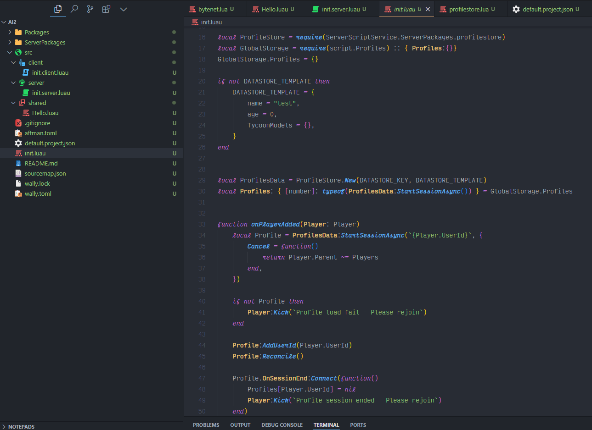

# OneDark Pro Roblox Theme

Um tema personalizado baseado no popular OneDark Pro, especificamente adaptado para desenvolvimento Roblox no Visual Studio Code.



## Visão Geral

Este tema é uma versão modificada do tema OneDark Pro, com foco exclusivo em fornecer destaque de sintaxe e estilo visual para desenvolvimento em Roblox/Luau. Enquanto o OneDark Pro original suporta múltiplas linguagens, esta versão foi otimizada para aprimorar a experiência de desenvolvimento Roblox.

## Características

- Destacamento de sintaxe personalizado para scripts Luau/Roblox
- Tema escuro otimizado para longas sessões de programação
- Cores cuidadosamente selecionadas para melhor legibilidade
- Estilização especial para:
  - Funções e classes da API Roblox
  - Elementos de sintaxe Luau
  - Comentários e strings
  - Variáveis e funções
  - Tabelas e metatables
  - Tratamento de erros
  - Arquivos de configuração JSON (Rojo, etc.)
  - E muito mais!

## Instalação

1. Abra o Visual Studio Code
2. Vá para Extensões (Ctrl+Shift+X)
3. Procure por "OneDark Pro Roblox Theme"
4. Clique em Instalar
5. Pressione Ctrl+K Ctrl+T para abrir o seletor de temas
6. Selecione "OneDark Pro Roblox Theme"

## Fonte Recomendada

Este tema foi otimizado para a fonte **Victor Mono**, que possui belos itálicos cursivos e ligaduras para símbolos de programação. Para obter a melhor experiência visual, adicione estas configurações ao seu `settings.json`:

```json
{
  "editor.fontFamily": "Victor Mono",
  "editor.fontLigatures": true,
  "editor.fontSize": 14,
  "editor.lineHeight": 24,
  "editor.letterSpacing": 0.5,
  "editor.fontWeight": "400",
  "terminal.integrated.fontFamily": "Victor Mono"
}
```

## Recursos Adicionais

- Suporte completo para sintaxe Luau
- Colorização especial para arquivos de configuração JSON do Rojo
- Destaque otimizado para palavras-chave, funções, variáveis globais e tipos
- Estilos diferenciados para funções e métodos da biblioteca standard
- Destaque para operadores e tratamento de erros

## Baseado em

Este tema é baseado no maravilhoso [OneDark Pro theme](https://github.com/Binaryify/OneDark-Pro) por Binaryify.

## Contribuições

Contribuições são bem-vindas! Sinta-se à vontade para abrir issues ou pull requests.

## Licença

MIT

